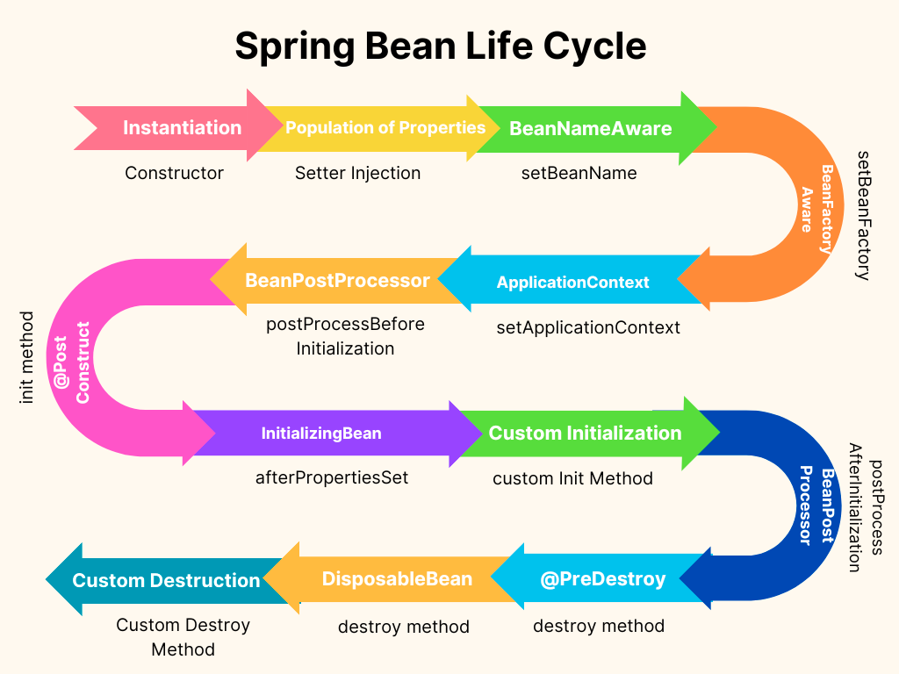

# 🌱 Spring Core and Bean Lifecycle - Cheat Sheet

## 🔍 Basic Concepts

- 🖥️ **Spring Framework**: Provides comprehensive infrastructural support for developing applications.
- 💖 **Spring IOC Container**: The heart of the Spring Framework that creates, manages, and configured beans.
- 🌱 **Bean**: An object that is instantiated, configured, and managed by a Spring IOC container.

## 💉 Spring Core Injection Types

Spring Core framework provides two types of Dependency Injection:

- 📝 **Setter Injection**: Dependencies are provided through setter methods of your beans.
  ```java
  public class TextEditor {
    private SpellChecker spellChecker;

    public void setSpellChecker(SpellChecker spellChecker) {
    this.spellChecker = spellChecker;
    }
  }
  ```

- 🚧 **Constructor Injection**: Dependencies are provided as constructor arguments.
  ```java
  public class TextEditor {
    private SpellChecker spellChecker;

    public TextEditor(SpellChecker spellChecker) {
    this.spellChecker = spellChecker;
    }
  }
  ```

## 🔭 Bean Scopes

Bean scopes in spring are:

- 🌍 **singleton**: (Default) Scopes a single bean definition to a single object instance per Spring IoC container.
- 🌱 **prototype**: A single bean definition to any number of object instances.
- 📨 **request**: Scopes a single bean definition to the lifecycle of a single HTTP request.
- 📄 **session**: Scopes a single bean definition to the lifecycle of an HTTP Session.
- 📘 **global-session**: Scopes a single bean definition to the lifecycle of a global HTTP Session.

> Note: In a standalone application, only singleton and prototype scopes are available.

## 🔌 Autowiring

Autowiring is Spring’s mechanism that allows you to inject the object dependency implicitly.

- 🚫 **No**: No autowiring. The ref attribute should be used to wire bean references.
- 🔤 **byName**: Autowiring by property name.
- 🔠 **byType**: Autowiring by property datatype.
- 🏗️ **constructor**: Similar to byType, but type applies to constructor arguments.


## 📐 `@Autowired` annotation / `@Inject`

The `@Autowired` annotation provides more fine-grained control over where and how autowiring should be accomplished. It can be used to autowire bean on the setter method, constructor, a property, or methods with arbitrary names and/or multiple arguments.`@Inject` does the same job but it is a standard annotation.

## 🔄 Understanding Spring Bean Lifecycle

The lifecycle of a Spring Bean is as follows:



1. **Instantiate**: The Spring container begins the bean lifecycle by instantiating the bean from the class definition.
2. **Populate properties**: The container reads the properties provided in the bean definition file and injects them into the bean.
3. **Set Bean Name**: In case the bean implements `BeanNameAware`, Spring passes the bean's id to `setBeanName()` method.
4. **Set Bean factory**: In case the bean implements `BeanFactoryAware`, Spring passes the bean factory to `setBeanFactory()` method.
5. **Pre Initialization - BeanPostProcessors**: The `postProcessBeforeInitialization()` method of all BeanPostProcessors are executed before invoking custom initialization methods.
6. **Initialize beans**: Init method is called.
7. **Post Initialization - BeanPostProcessors**: The `postProcessAfterInitialization()` method of all BeanPostProcessors are invoked.
8. **Ready to use**: The bean is ready to be used by the application.
9. **Destroy**: When the container shuts down, destroy method is called.

> Note: The "init" and "destroy" method names are conventional, but you can provide custom names for these methods.

You can also control the lifecycle of a bean using `@PostConstruct` and `@PreDestroy` annotations which are a part of the JSR-250 specification. These are preferred over `InitializingBean` and `DisposableBean` callback interfaces.
