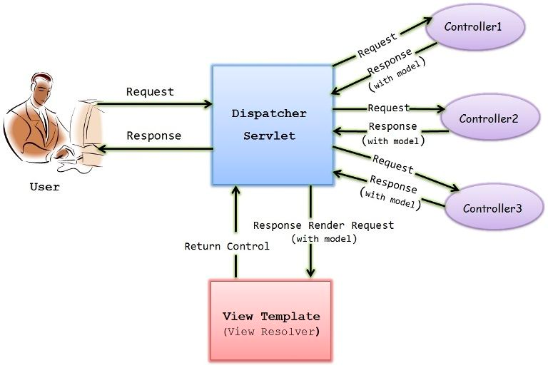

# 🌐 What is Spring MVC?

Spring MVC (Model-View-Controller) is a widely-used framework that simplifies the development of robust and scalable web applications in Java. With its modular architecture and well-defined separation of concerns, Spring MVC empowers developers to build clean, maintainable, and flexible code.

## 💡 Key Features:

1. **Model-View-Controller Design:** Spring MVC follows the MVC pattern, allowing for a clear separation of data (Model), user interface (View), and control logic (Controller). This promotes code reusability and easier maintenance.

2. **Annotation-Based Configuration:** Spring MVC leverages annotations to configure controllers, mappings, and other components, reducing the need for verbose XML configurations and making development more concise.

3. **Flexible Request Handling:** Handle various types of requests effortlessly, whether it's traditional form-based submissions, RESTful APIs, or even WebSocket interactions.

4. **Thorough Testing Support:** Spring MVC offers comprehensive support for unit and integration testing, helping developers ensure the quality of their applications.

5. **Integration with Spring Ecosystem:** Seamlessly integrate with other Spring modules like Spring Boot, Spring Security, and Spring Data, enhancing your application's capabilities.

## 🚀 Why Choose Spring MVC?

Spring MVC's popularity stems from its ability to streamline development, improve code organization, and enhance productivity. By harnessing its features, you can focus on creating exceptional user experiences rather than getting bogged down by intricate technicalities.

# 🌐 Spring MVC - Cheat Sheet

## 🧩 MVC Components

**Model** 🗄️: Represents your data structures. Typically, your model classes will have no dependencies on the specifics of your view or controller classes.

**View** 🖥️: Renders the contents of a model. It gets its instructions on what to display from the controller.

**Controller** ⚙️: A controller is the link between a user and the system. It processes all business logic and incoming requests, manipulates data using the Model, and selects views to render that display UI.

## 🔄 Spring MVC Flow



1. User sends a request which hits the `DispatcherServlet`.
2. `DispatcherServlet` finds the appropriate `Controller`.
3. `Controller` processes the request, populates the `Model`, and returns the `View` name to the `DispatcherServlet`.
4. `DispatcherServlet` resolves the `View` with the help of `ViewResolver`.
5. `View` is rendered and the response is sent to the client.

## 🏷️ Basic Annotations

- 🎛️ **@Controller**: Indicates that the class is a Spring controller. It's a specialization of the `@Component` annotation and allows auto-detection through classpath scanning.

- ⚙️ **@Service**: Marks a class that performs some service, such as business logic, calculations, or calling external APIs. It's a specialized form of the `@Component` annotation for the service layer.

- 🗄️ **@Repository**: Used on classes that directly access the database (Repository or Data Access Object). It acts as a marker for automatic translation of exceptions related to database operations.

- 🚦 **@RequestMapping**: Marks request handling methods inside `@Controller` classes. It specifies URL, HTTP methods, parameters, headers, consumes, and produces for handling requests.

- 🕹️ **@RequestBody**: Binds a method parameter to the body of the web request. It maps the HTTP request body to an object using `HttpMessageConverter`.

- 🧭 **@GetMapping, @PostMapping, @PutMapping, @DeleteMapping, @PatchMapping**: Shortcut annotations for mapping HTTP methods to specific handler methods.

- 🛡️ **@ControllerAdvice**: Applied at the class level. It's used for defining exception handlers, init binders, and model attributes that apply to all `@RequestMapping` methods.

- 🎛️ **@ResponseBody**: Informs Spring to convert the return value to the HTTP response automatically. It treats the result of the method as the response itself.

- 🚧 **@ExceptionHandler**: Declares a custom error handler method. It's called when a request handler method throws specified exceptions.

- 🚥 **@ResponseStatus**: Specifies the desired HTTP status for the response. It's applied to request handler methods.

- 🚩 **@PathVariable**: Indicates that a method argument is bound to a URI template variable.

- 📩 **@RequestParam**: Binds a method parameter to a web request parameter. It's used for accessing HTTP request parameters, with an option for a default value.

- 🎮 **@RestController**: Combines `@Controller` and `@ResponseBody`. It eliminates the need to add `@ResponseBody` to individual request mapping methods.

- 📘 **@ModelAttribute**: Accesses elements already in the model of an MVC `@Controller`.

- ✈️ **@CrossOrigin**: Enables cross-domain communication for annotated request handler methods. It can be used at the class level to apply to all methods.

- 🧰 **@InitBinder**: Method-level annotation for initializing the `WebDataBinder`. It's used to customize request parameter data binding.

## 👨‍💻 Creating a Basic Spring MVC Controller

In the code snippet below, an attribute gets added to the model, and the view name that needs to be rendered gets returned.

```java
@Controller
public class HelloWorldController {

  @RequestMapping("/hello")
  public String sayHi(Model model) {
    model.addAttribute("message", "Hello Spring MVC!");
    return "helloWorld";
  }
}
```

## 🎁 Creating a View using ViewResolver

A `ViewResolver` helps `DispatcherServlet` identify which view should be rendered in response, based on the view name.

```java
@Configuration
@EnableWebMvc
@ComponentScan("com.example.app")
public class AppConfig {
  
  @Bean
  public ViewResolver viewResolver() {
    InternalResourceViewResolver viewResolver = new InternalResourceViewResolver();
    viewResolver.setPrefix("/WEB-INF/views/");
    viewResolver.setSuffix(".jsp");
    return viewResolver;
  }
}
```

## 👮‍♀️ Exception Handling in Spring MVC

Below is an example of how to create a `ControllerAdvice` to handle exceptions globally.

```java
@ControllerAdvice
public class GlobalExceptionHandler {

  @ExceptionHandler(Exception.class)
  public ModelAndView handleException(Exception ex) {
    ModelAndView model = new ModelAndView("error");
    model.addObject("exception", ex.getMessage());
    return model;
  }
}
```